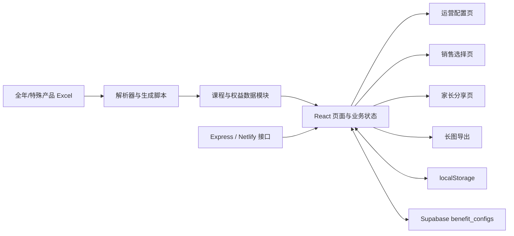

# 项目架构说明

## 当前结构

项目是 Vite + React 单页应用，辅以 Express 接口服务、Excel 解析、Supabase 配置同步和 html2canvas 长图导出。



## 入口与职责

| 层级 | 当前文件 | 当前职责 |
| --- | --- | --- |
| 页面入口 | `src/main.jsx` | 页面模式、状态、业务规则、云端同步、导出及大部分组件 |
| 全局样式 | `src/styles.css` | 后台、销售、分享、移动端、打印和导出样式 |
| 产品数据 | `src/data/products.js` | 产品初始配置及价格、阶段等信息 |
| 课程数据 | `src/data/annualCourseLibrary.js`、`src/data/courseCatalog.js` | 全年课程和课程目录生成结果 |
| 专项数据 | `src/data/g1AutumnCourseData.js` | 高一秋实卡专项课程信息 |
| 权益数据 | `src/data/giftCatalog.js`、`src/data/g1AutumnGiftData.js`、`src/data/teachingAidCatalog.js` | 赠课、实物和教辅资料 |
| 表格解析 | `src/lib/courseWorkbookParser.js` | Excel 工作簿解析和科目识别 |
| 云端结构 | `supabase/schema.sql` | `benefit_configs` 等云端表结构 |
| 本地接口 | `server.js` | API 服务及外部请求代理 |
| 部署接口 | `netlify/functions/competitor.js` | Netlify 函数版本接口 |

## 配置读取与保存

应用目前同时存在三类配置来源：

1. 代码内置初始数据，用于首次打开和云端不可用时的基础展示。
2. 浏览器 `localStorage`，保存当前电脑上的运营修改。
3. Supabase `benefit_configs`，用于让不同设备和分享链接读取同一份配置。

后续结构优化要把“配置读取优先级、保存状态、错误提示”集中到单独服务中，页面只消费最终配置，不直接拼接请求。

## 构建与部署

- 本地开发由 Vite 提供。
- GitHub Pages 使用 `npm run build:pages`，基础路径为 `/lingshi-/`。
- 静态图片应放在 `public/assets`，代码中使用兼容 GitHub Pages 基础路径的地址。
- Supabase 负责业务配置数据，不负责托管前端页面。
- `.env` 和 `.env.production` 提供云端连接参数，不能提交密钥。

## 主要结构问题

1. `src/main.jsx` 超过 4,000 行，页面、数据转换、网络请求和导出逻辑互相牵连。
2. `src/styles.css` 接近 10,000 行，多个页面与导出模式的选择器难以定位。
3. 产品文案、价格、赠送规则、图片映射和基础常量仍有部分位于页面入口。
4. 全年课程库与课程目录是超大生成文件，缺少醒目的生成边界。
5. 配置保存与页面状态耦合，修改小模块时容易被迫阅读完整入口。
6. 清单版、明细版、分享页和导出长图之间存在重复展示和重复样式。

## 目标结构

本次优化不重写项目，逐步形成以下边界：

```text
src/
  app/                 # 应用入口、路由模式与顶层状态
  components/          # 可复用界面组件
    admin/
    sales/
    benefits/
    shared/
  config/              # 稳定枚举、展示文案、图片映射
  data/                # 初始数据与生成数据
    generated/
  domain/              # 纯业务规则、筛选、价格与赠送计算
  lib/                 # Excel、导出等通用工具
  services/            # Supabase、本地存储和接口请求
  styles/              # 按页面和用途拆分的样式
  main.jsx             # 仅挂载应用
```

## 分层原则

- `config`：描述“有哪些选项、显示什么文字、图片在哪里”。
- `data`：保存初始数据和生成后的课程数据，不执行页面逻辑。
- `domain`：接收数据并返回结果，不访问 DOM、网络或浏览器存储。
- `services`：处理网络、云端、本地存储和错误转换。
- `components`：只负责交互和展示，避免再次定义业务数据。
- `styles`：按后台、销售/分享、权益内容、移动端和导出拆分。

## 渐进迁移边界

1. 先建立文档和修改地图。
2. 再抽离稳定配置，不改变任何渲染结果。
3. 再抽离纯业务规则和数据转换，并补局部验证。
4. 再按页面拆分组件。
5. 最后拆分样式，并用截图比对桌面、移动端和导出结果。

每一步都应保留原入口可运行，并单独提交。
